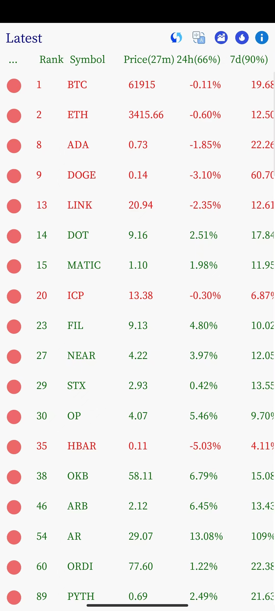

[中文文档](./README.zh-CN.md)

#### Introduction
It is a simple Android App for displaying cryptocurrency price information. Based on `Rust` and `egui`. Use [coinmarketcap](https://coinmarketcap.com/) provided `API` to fetch data.

#### Features
- [x] show top 100 cryptocurrency information.
- [x] show economy statistic data
- [ ] show top 100 trending cryptocurrency price and sorted by CoinMarketCap search volume.

#### Use your own coinmarketcap API key
- edit `./picon/src/apikey.rs`
    ```
    pub const CMC_PRO_API_KEY: &str = "Your-API-Key";
    ```
- rebuild: `make`

#### How to build?
- Install Android `sdk`, `ndk`, `jdk17`, and set environment variables
- Install `Rust` and `Cargo`
- Run `make`
- Refer to [Makefile](./Makefile) and [build.help](./build.help) for more information

#### Reference
- [egui](https://github.com/emilk/egui)
- [rust-android-examples](https://github.com/rust-mobile/rust-android-examples)
- [cross-platform-rust-http-request](https://logankeenan.com/posts/cross-platform-rust-http-request/)

