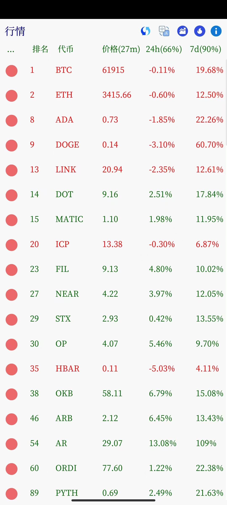

[English Documentation](./README.md)

#### 简介
一个简单的安卓加密行情软件。基于`Rust`和`egui`实现。使用 [coinmarketcap](https://coinmarketcap.com/) 提供的API获取数据。

#### 功能
- [x] 显示市值前100加密货币行情
- [ ] 热门代币行情

#### 如何使用coinmarketcap API-Key?
- 编辑 `./picon/src/apikey.rs`
    ```
    pub const CMC_PRO_API_KEY: &str = "Your-API-Key";
    ```
- 重新工具: `make`

#### 如何构建?
- 安装 Android `sdk`, `ndk` 和 `jdk17`，并配置相应的环境变量
- 安装 `Rust` 和 `Cargo`
- 运行 `make`
- 参考 [Makefile](./Makefile) 和 [build.help](./build.help) 了解更多信息

#### 参考
- [egui](https://github.com/emilk/egui)
- [rust-android-examples](https://github.com/rust-mobile/rust-android-examples)
- [cross-platform-rust-http-request](https://logankeenan.com/posts/cross-platform-rust-http-request/)
